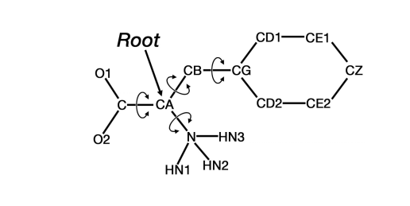

PDBQT Format for Coordinate Files
=================================

This is copied straight from the Autodock 4.2 manual. 
It might be helpful to have a record of it here. 

**Extension**: .pdbqt

.. code-block::

    “ATOM◼◼%5d◼%-4s%1s%-3s◼%1s%4d%1s◼◼◼%8.3f%8.3f%8.3f%6.2f%6.2f%4s%6.3f◼%2s \n",
    atom_serial_num, atom_name, alt_loc, res_name, chain_id, res_num, ins_code, x, y, z, occupancy, temp_factor, footnote, partial_charge, atom_type

(The “◼” symbol is used to indicate one space.)

The PDBQT format adds four things to standard formatted PDB files:

1. partial charges are included in each ATOM or HETATM record, substituting for the fields in columns 67-76.

2. AutoDock atom types (which may be one or two letters) are included in each ATOM or HETATM record from column 78 to the next whitespace.

3. To allow flexibility in the ligand, it is necessary to assign the rotatable bonds. AutoDock can handle up to MAX_TORS rotatable bonds: this parameter is defined in “autodock.h”, and is ordinarily set to 32. If this value is changed, AutoDock must be recompiled. Torsions are defined in the PDBQT file using the following keywords:

.. code-block:: 

    ROOT / ENDROOT
    BRANCH / ENDBRANCH

4. These keywords use the metaphor of a tree. See the diagram below for an example. The “root” is defined as the central portion of the ligand, from which rotatable ‘branches’ sprout. Branches within branches are possible. Nested rotatable bonds are rotated in order from the “leaves” to the “root”. The PDBQT keywords must be carefully placed, and the order of the ATOM or HETATM records often need to be changed in order to fit into the correct branches. 

5. The number of torsional degrees of freedom, which will be used to evaluate the conformational entropy, is specified using the TORSDOF keyword followed by the integer number of rotatable bonds. In the current AutoDock 4.2 force field, this is the total number of rotatable bonds in the ligand, including rotatable bonds in hydroxyls and other groups where only hydrogen atoms are moved, but excluding bonds that are within cycles.  

**Note**: AutoDockTools, AutoGrid,  AutoDock, and Meeko do not recognize or write out PDB “CONECT”
records.

Sample PDBQT file:

.. code-block:: 

    REMARK 4 active torsions:
    REMARK status: ('A' for Active; 'I' for Inactive)
    REMARK 1 A between atoms: N_1 and CA_5
    REMARK 2 A between atoms: CA_5 and CB_6
    REMARK 3 A between atoms: CA_5 and C_13
    REMARK 4 A between atoms: CB_6 and CG_7
    ROOT
    ATOM 1 CA PHE A 1 25.412 19.595 12.578 1.00 12.96 0.287 C
    ENDROOT
    BRANCH 1 2
    ATOM 2 N PHE A 1 25.225 18.394 13.381 1.00 13.04 -0.065 N
    ATOM 3 HN3 PHE A 1 25.856 17.643 13.100 1.00 0.00 0.275 HD
    ATOM 4 HN2 PHE A 1 25.558 18.517 14.337 1.00 0.00 0.275 HD
    ATOM 5 HN1 PHE A 1 24.247 18.105 13.350 1.00 0.00 0.275 HD
    ENDBRANCH 1 2
    BRANCH 1 6
    ATOM 6 CB PHE A 1 26.873 20.027 12.625 1.00 12.45 0.082 C
    BRANCH 6 7
    ATOM 7 CG PHE A 1 27.286 20.629 13.923 1.00 12.96 -0.056 A
    ATOM 8 CD2 PHE A 1 27.470 22.001 14.050 1.00 12.47 0.007 A
    ATOM 9 CE2 PHE A 1 27.877 22.571 15.265 1.00 13.98 0.001 A
    ATOM 10 CZ PHE A 1 28.108 21.754 16.360 1.00 13.84 0.000 A
    ATOM 11 CE1 PHE A 1 27.919 20.380 16.242 1.00 13.77 0.001 A
    ATOM 12 CD1 PHE A 1 27.525 19.821 15.027 1.00 11.32 0.007 A
    ENDBRANCH 6 7
    ENDBRANCH 1 6
    BRANCH 1 13
    ATOM 13 C PHE A 1 25.015 19.417 11.141 1.00 13.31 0.204 C
    ATOM 14 O2 PHE A 1 24.659 20.534 10.507 1.00 12.12 -0.646 OA
    ATOM 15 O1 PHE A 1 25.024 18.283 10.608 1.00 13.49 -0.646 OA
    ENDBRANCH 1 13
    TORSDOF 4

