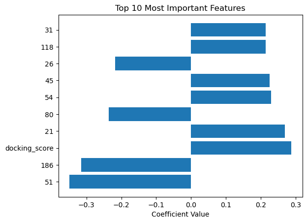

.. _tutorial4b:

=================================================
Retrospective Docking Analysis and Model Building
=================================================

Introduction
============

Using the outcomes from the preivous tutorial, this tutorial is intended to show the basic procedure of ligand reconstruction, computing of assessment metrics (ROC-AUC, EF) in a retrospective docking analysis, and the building of regression model involving interaction vectors from AutoDock-GPU. 

The main purpose of this tutorial is to show how to build the necessary interface between packages in retrospective docking analysis and model building via a practical example. But please note that the outcomes and conclusions should not be judged professionally. In practice, thorough profiling of the dataset and feature space, careful selection of the regression model, and fine-tuning of the meta-parameters are all necessary steps to achieve an optimal model. 

Additional Dependencies
=======================

    - scikit-learn (sklearn)

Single-Pose Molecule Reconstruction
===================================

In this section, we demonstrate how to use Meeko's API functions to reconstruct RDKit molecules from docking results stored in a Ringtail database, which is essentially a SQLite databse. This reconstruction approach aligns with the internal method Ringtail uses when exporting filtered poses to SDF files. Instead of applying Ringtail’s built-in filtering tools, we will select poses using a custom SQL query. The selected poses will then be reconstructed using their SMILES strings, atom index mappings, hydrogen-parent relationships, and 3D coordinates. 

To begin with, we will use Ringtail to extract, transform and store the docking results from *.dlg files of both the actives and decoys ligand sets. Assuming that the *.dlg files are located in the folders named "4EY7_actives" and "4EY7_decoys" in the current directly, we will use the following Python code snippet to write all docking results to a Ringtail database. 

.. code-block:: python

    from ringtail import RingtailCore

    rtc = RingtailCore(db_file = "4EY7_combined.db", docking_mode = "dlg")
    rtc.add_results_from_files(file_path = ["4EY7_actives", "4EY7_decoys"])

The operations are committed instantly to the database. Consequently, a database file "4EY7_combined.db" will be created in the current directory. 

In the following Python code block, we have first defined a helper function `rebuild_mol_meeko` to reconstruct the RDKit molecule from the docking results. The function takes the SMILES string, 3D coordinates (JSON strings), atom index mapping (JSON strings), and hydrogen-parent relationships (JSON strings) as inputs. The function then uses Meeko's `RDKitMolCreate` class to add the pose to the molecule and update the hydrogen positions. 

.. code-block:: python

    import sqlite3
    import pandas as pd
    import json
    from rdkit import Chem
    from rdkit.Chem import SDWriter
    from meeko.rdkit_mol_create import RDKitMolCreate 

    def rebuild_mol_meeko(smiles, coordinates_json, atom_index_map_json, h_parent_json=None):
        """
        Rebuild an RDKit molecule with 3D pose coordinates using Meeko utilities.

        Parameters
        ----------
        smiles : str
            Canonical ligand SMILES.
        coordinates_json : str
            JSON-encoded list of 3D coordinates [['x', 'y', 'z'], ...].
        atom_index_map_json : str
            JSON-encoded flat list: [mol_idx_1, pose_idx_1, mol_idx_2, pose_idx_2, ...].
        h_parent_json : str, optional
            JSON-encoded list of [mol_idx_H, pose_idx_H, ...] for polar hydrogens.

        Returns
        -------
        Chem.Mol
            RDKit molecule with a conformer reconstructed from the pose.
        """

        # Create base molecule
        mol = Chem.MolFromSmiles(smiles)
        # Parse coordinates: [['x', 'y', 'z'], ...] → [(float, float, float), ...]
        coordinates = [tuple(map(float, coord)) for coord in json.loads(coordinates_json)]
        # Parse atom index map: [mol_idx1, pose_idx1, mol_idx2, pose_idx2, ...]
        index_map = [int(x) for x in json.loads(atom_index_map_json)]
        # Apply pose to molecule using Meeko logic
        mol = RDKitMolCreate.add_pose_to_mol(mol, coordinates, index_map)
        # Update hydrogen positions
        if h_parent_json:
            h_parent = [int(x) for x in json.loads(h_parent_json)]
            mol = RDKitMolCreate.add_hydrogens(mol, [coordinates], h_parent)

        return mol

Next, we will reconnect to the Ringtail database and use a custom SQL query to select the docking results. This sample SQL query selects the poses with best score per ligand. A list of reconstructed molecules is then created, where each molecule is assigned the ligand name and docking score as properties. Finally, the reconstructed molecules can be written to a single SDF file, or subject to further analysis with RDKit. 

.. code-block:: python

    # Connect to the Ringtail database
    conn = sqlite3.connect("4EY7_combined.db")
    cursor = conn.cursor()

    # SQL query to select the best pose per ligand
    best_pose_query = """
    SELECT LigName, Pose_ID, docking_score
    FROM Results AS R1
    WHERE docking_score = (
        SELECT MIN(docking_score)
        FROM Results AS R2
        WHERE R1.LigName = R2.LigName
    )
    """

    # Conviniently, created a table to store the best poses
    best_df = pd.read_sql(best_pose_query, conn)

    # Reconstruct molecules
    reconstructed_mols = []
    for _, row in best_df.iterrows():
        pose_id = row["Pose_ID"]
        ligand_name = row["LigName"]
        docking_score = row["docking_score"]

        # Retrieve SMILES, index map and hydrogen parents from the Ligands table, 
        # and pose coordinates from the Results table
        cursor.execute("""
        SELECT L.ligand_smile, R.ligand_coordinates, L.atom_index_map, L.hydrogen_parents
        FROM Ligands L
        JOIN Results R ON L.LigName = R.LigName
        WHERE R.Pose_ID = ?
        """, (pose_id,))
        row = cursor.fetchone()
        smiles, coords_json, index_map_json, h_parent_json = row
        
        mol = rebuild_mol_meeko(smiles, coords_json, index_map_json, h_parent_json)
        mol.SetProp("ligand_name", ligand_name)
        mol.SetProp("docking_score", f"{docking_score:.3f}")
        reconstructed_mols.append(mol)
    conn.close()

    # Optionally, write the reconstructed molecules to a single SDF file
    with SDWriter("4EY7_best_poses reconstructed.sdf") as writer:
        for mol in reconstructed_mols:
            writer.write(mol)
    
While the docking results are stored in the database as JSON-encoded fields, this section shows how they can be efficiently reconstituted into usable RDKit molecules. This "re-hydration" step complements the earlier ETL process by enabling further cheminformatics analysis and modeling. The reconstructed molecules serve as tangible, analyzable outputs ready for visualization, feature extraction, or machine learning workflows. 

Basic Metrics (ROC AUC, EF) based on Single Numerical Metric
============================================================

ROC AUC (Area Under the Receiver Operating Characteristic Curve) and EF (Enrichment Factor) are two commonly used metrics in retrospective docking analysis to evaluate the performance of a docking protocol. In this section, we will use the docking score as the single numerical metric and compute the ROC AUC and EF values. 

To begin with, we will need to label the actives and decoys in the docking results. There are various ways to do this, and in this example we will just use the ligand names to locate the input files and assign the labels accordingly. If working with larger datasets, having these labels entered into the Ligands table in the SQLite database would be more efficient to avoid repeated lookup. 

.. code-block:: python

    import glob

    # Keep record of active and decoy ligands
    active_list = [x.replace("actives_final/", "").replace(".pdbqt", "") for x in glob.glob("actives_final/*.pdbqt")]
    decoy_list = [x.replace("decoys_final/", "").replace(".pdbqt", "") for x in glob.glob("decoys_final/*.pdbqt")]

Now, we will continue our work on the previously generated DataFrame "best_df" and add a new column "label" to indicate whether the ligand is an active or decoy. Active ligands will be labeled as 1, while decoys will be labeled as 0. 

.. code-block:: python

    # Add a label column to the best_df DataFrame
    best_df["label"] = 0
    best_df.loc[best_df["LigName"].isin(active_list), "label"] = 1

Here we will provide you with some reusable code snippets to compute these basic metrics:  

.. code-block:: python

    from sklearn.metrics import roc_auc_score

    def enrichment_factor(scores, labels, top_fraction=0.01):
        """
        Calculate the enrichment factor (EF) for a given set of scores and labels.
        The EF is a measure of how well the top fraction of scores enriches the active compounds.

        Parameters
        ----------
        scores : list
            List of docking scores (lower is better).
        labels : list
            List of binary labels (1 for active, 0 for decoy).
        top_fraction : float
            Fraction of top scores to consider for enrichment (default is 0.01).
        
        Returns
        -------
        float
            Enrichment factor (EF) value.
        """

        N = len(scores)
        top_n = max(1, int(N * top_fraction))
        
        df = pd.DataFrame({"score": scores, "label": labels})
        df = df.sort_values(by="score")  # assuming more negative = better docking score
        top_hits = df.head(top_n)
        
        num_actives_in_top = top_hits["label"].sum()
        total_actives = df["label"].sum()
        
        if total_actives == 0:
            return 0
        ef = (num_actives_in_top / top_n) / (total_actives / N)
        
        return ef

At this point, you may already find out that we are about to make the very naive, yet extremely common assumption that the docking score on its own is a good predictor to discriminate active ligands and inactives. We will compute the ROC AUC and EF values and see if that's true in our case (or your own benchmarking calculation)... 

.. code-block:: python

    # Compute and get the ROC AUC and enrichment factor at 1% of the dataset
    scores, labels = best_df["docking_score"], best_df["label"]
        
    auc = roc_auc_score(labels, -scores)  # use -score since lower is better
    ef1 = enrichment_factor(scores, labels, top_fraction=0.01)

    print(f"   ROC AUC: {auc:.3f}")
    print(f"   EF1%   : {ef1:.2f}\n")

In this example, we have used the docking score as the single numerical metric to compute the ROC AUC and EF values. Unfortunately, the ROC AUC value is not very high (0.441), and the EF value is also not very impressive (1.87). This indicates that the docking score alone may not be a reliable predictor of ligand activity in our case. In the next section, we will explore the use of interaction vectors to improve the predictive power. 

Vectorization of Interactions
=============================

To perform advanced, interaction-based statistical analysis or machine learning on the docking results, we need to extract the interaction vectors from the Ringtail database. So first, we will populate a "record" dictionary by retriving the information for all poses in the database. Specifically, this dictionary will contain the following information:
- `pose_id`: The unique identifier for the pose.
- `ligand_name`: The name of the ligand.
- `docking_score`: The docking score of the pose.
- `leff`: The ligand efficiency of the pose.
- `interactions`: A list of interaction IDs associated with the pose.

And again, we will be labeling, if not already, the actives and decoys in the docking results: 
- `label`: The label indicating whether the ligand is an active or decoy.

Below is a complete, from-start-to-end, Python script that populates such "record" and print for preview: 

.. code-block:: python

    import glob
    import sqlite3

    # Get label information, if it's not already in the database
    active_list = [x.replace("actives_final/", "").replace(".pdbqt", "") for x in glob.glob("actives_final/*.pdbqt")]
    decoy_list = [x.replace("decoys_final/", "").replace(".pdbqt", "") for x in glob.glob("decoys_final/*.pdbqt")]

    # Connect to the database
    conn = sqlite3.connect("4EY7_combined.db")
    cursor = conn.cursor()

    # Query to join Results and Interactions tables on Pose_ID
    cursor.execute("""
        SELECT r.Pose_ID, r.LigName, r.docking_score, r.leff, GROUP_CONCAT(i.interaction_id) AS interactions
        FROM Results r
        LEFT JOIN Interactions i ON r.Pose_ID = i.Pose_ID
        GROUP BY r.Pose_ID
    """)

    # Fetch and process the results
    rows = cursor.fetchall()

    # List to store individual records (each row as a separate record)
    ligand_data = []

    if rows:
        for row in rows:
            pose_id, ligand_name, docking_score, leff, interactions = row

            # Store each pose as a separate record with its corresponding data
            record = {
                'pose_id': pose_id,
                'ligand_name': ligand_name,
                'docking_score': docking_score,
                'leff': leff,
                'interactions': interactions.split(',') if interactions else [],
            }

            # Assign a label based on whether the ligand is in the active or decoy list
            if ligand_name in active_list:
                record['label'] = 'active'
            elif ligand_name in decoy_list:
                record['label'] = 'decoy'

            # Append the record
            ligand_data.append(record)

        # Print the records for inspection
        for record in ligand_data:
            print(f"Pose ID: {record['pose_id']}")
            print(f"Ligand Name: {record['ligand_name']}")
            print(f"Docking Score: {record['docking_score']}")
            print(f"Ligand Efficiency: {record['leff']}")
            print(f"Interactions: {record['interactions']}")
            print(f"Label: {record['label']}")
    else:
        print("No data found.")

    # Close the connection
    conn.close()

With that, the "record" is filled with raw data from the database like the following: 

.. code-block:: bash

    Pose ID: 1
    Ligand Name: CHEMBL299313_0
    Docking Score: -10.4
    Ligand Efficiency: -0.4
    Interactions: ['0', '1', '2', '3', '4', '5', '6', '7', '8', '9', '10', '11', '12', '13', '14', '15', '16', '17', '18', '19', '20', '21', '22', '23', '24', '25', '26', '27', '28', '29']
    Label: active
    Pose ID: 2
    Ligand Name: CHEMBL299313_0
    Docking Score: -9.97
    Ligand Efficiency: -0.38346153846153846
    Interactions: ['0', '1', '4', '5', '6', '8', '9', '11', '12', '14', '15', '17', '18', '19', '21', '22', '25', '27', '28', '30', '31', '32', '33', '34', '35', '36', '37', '38', '39']
    Label: active
    Pose ID: 3
    Ligand Name: CHEMBL299313_0
    Docking Score: -9.75
    Ligand Efficiency: -0.375
    Interactions: ['0', '1', '3', '5', '6', '7', '8', '9', '10', '12', '13', '14', '15', '18', '19', '24', '25', '27', '40', '41', '42', '43', '44', '45', '46', '47', '48', '49', '50', '51', '52']
    Label: active
    Pose ID: 4
    Ligand Name: CHEMBL610243_0
    Docking Score: -10.26
    Ligand Efficiency: -0.30176470588235293
    Interactions: ['0', '3', '4', '7', '15', '17', '18', '21', '22', '24', '26', '27', '28', '31', '32', '33', '34', '35', '37', '38', '39', '42', '44', '46', '48', '50', '51', '52', '53', '54', '55', '56', '57', '58', '59', '60', '61', '62', '63', '64', '65', '66', '67', '68', '69']
    Label: active
    Pose ID: 5
    ...

At this point, we are not yet ready to build a regression model, as we need to convert the interaction vectors into a suitable format. Moreover, we might want to normalize the feature values to ensure that they are on the same scale. Herein, we are providing the following reusable code snippet as a standard procedure to convert, especially the interaction vectors, into a usable format. 

.. code-block:: python

    from sklearn.model_selection import train_test_split
    from sklearn.linear_model import LogisticRegression
    from sklearn.metrics import classification_report
    from sklearn.feature_extraction import DictVectorizer
    from sklearn.preprocessing import StandardScaler
    import joblib

    def prepare_features_and_labels(ligand_data: list[dict]):
        """Prepare features and labels for regression model training."""
        X = []  # List to store feature vectors
        y = []  # List to store labels (active=1, decoy=0)

        # Process each ligand data entry
        for record in ligand_data:
            # Feature vector: Docking score, ligand efficiency (leff), and interaction vector
            features = {
                'docking_score': record['docking_score'],
                'leff': record['leff'],
            }
            
            # Interaction vector: we assume that the `interactions` field contains a list of interaction IDs
            interaction_vector = dict.fromkeys(record['interactions'], 1)  # Binary vector (1 if interaction is present)
            
            # Merge docking score, leff, and interaction vector
            features.update(interaction_vector)
            
            # Append the features to X and label to y
            X.append(features)
            y.append(1 if record['label'] == 'active' else 0)  # Assign label 1 for active, 0 for decoy

        return X, y

    def vectorize_features(X: list[dict]):
        """Vectorize all features using DictVectorizer."""
        vectorizer = DictVectorizer(sparse=False)  # Use sparse=False for a dense matrix
        X_vectorized = vectorizer.fit_transform(X)  # Convert to vectorized format
        return X_vectorized, vectorizer

    # Prepare the data for training the regression model
    X, y = prepare_features_and_labels(ligand_data)

    # Vectorize the features (including interactions)
    X_vectorized, vectorizer = vectorize_features(X)

    # Optionally, scale the features (important for models like logistic regression)
    scaler = StandardScaler()
    X_scaled = scaler.fit_transform(X_vectorized)

    # Split the data into training and testing sets (80% train, 20% test)
    X_train, X_test, y_train, y_test = train_test_split(X_scaled, y, test_size=0.2, random_state=42)

In this example, we first convert the interaction vectors into a binary feature dictionary, so that they can be vectorized together with the docking score and ligand efficiency by `DictVectorizer` from scikit-learn. Technically, the interaction vectors are transformed into a multi-label binary format (one-hot encoding) where each interaction ID becomes a separate feature with a value of 1 if present and 0 otherwise. 

If you are running the code block in a Jupyter notebook, you may want to keep the "X_train, X_test, y_train, y_test" intact for later use with different regression models. 

Logistic Regression and Explanation by Coefficients
===================================================

Now, our task will be: to find out the most important features that help to discriminate actives and decoys, and to build a regression model that can predict the activity of a ligand based on its docking score, ligand efficiency, and interaction vectors. We will begin with the relatively simple and interpretable Logistic Regression model with L2 regularization. 

.. code-block:: python

    # Train a Logistic Regression Model
    model = LogisticRegression(max_iter=5000, solver='liblinear', penalty='l2', C=0.01)  # use a smaller C, a.k.a. higher regularization strength if there are imbalanced features
    model.fit(X_train, y_train)

    # Evaluate the model on the test data
    y_pred = model.predict(X_test)

    # Print classification report (accuracy, precision, recall, F1-score)
    print(classification_report(y_test, y_pred))

    # Step 7: Print Feature Weights (Coefficients)
    # Get feature names from the vectorizer
    feature_names = vectorizer.get_feature_names_out()

    # Get the coefficients from the model
    coefficients = model.coef_[0]

    # Print each feature with its corresponding weight (coefficient)
    for feature, coefficient in zip(feature_names, coefficients):
        print(f"Feature: {feature}, Weight: {coefficient}")

In our case, the Logistic Regression model achieved a recall of 0.78 on actives (class = 1) meaning the model is retrieving a good fraction of true binders. And a precision of 0.75 on actives means that 3 out of 4 predicted actives are actually active. 

Logistic Regression is a linear model, and therefore, the feature importance and the direction of correlation can be determined from the absolute values and the signes of the coefficients. Here's a simple code snippet to visualize the top 10 features with the highest absolute coefficients: 

.. code-block:: python

    import matplotlib.pyplot as plt
    import pandas as pd

    # Visualize feature importance
    coefficients = model.coef_[0]
    features = vectorizer.get_feature_names_out()

    # Create a DataFrame to easily sort the features by importance
    feature_importance = pd.DataFrame({
        'Feature': features,
        'Coefficient': coefficients
    })

    # Sort by absolute coefficient value
    feature_importance['Absolute Coefficient'] = feature_importance['Coefficient'].abs()
    feature_importance = feature_importance.sort_values(by='Absolute Coefficient', ascending=False)

    # Plot the top 10 most important features
    top_features = feature_importance.head(10)
    plt.barh(top_features['Feature'], top_features['Coefficient'])
    plt.xlabel('Coefficient Value')
    plt.title('Top 10 Most Important Features')
    plt.show()

XGBoost Modeling and Explanation with SHAP
=========================================